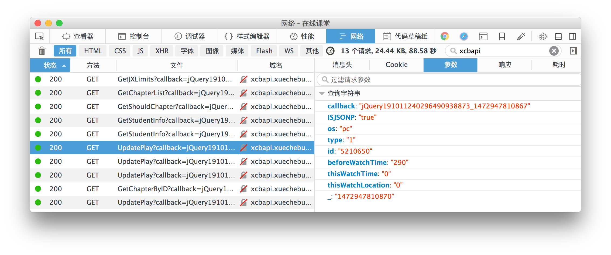
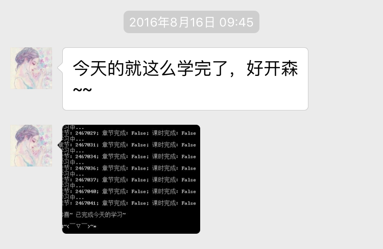
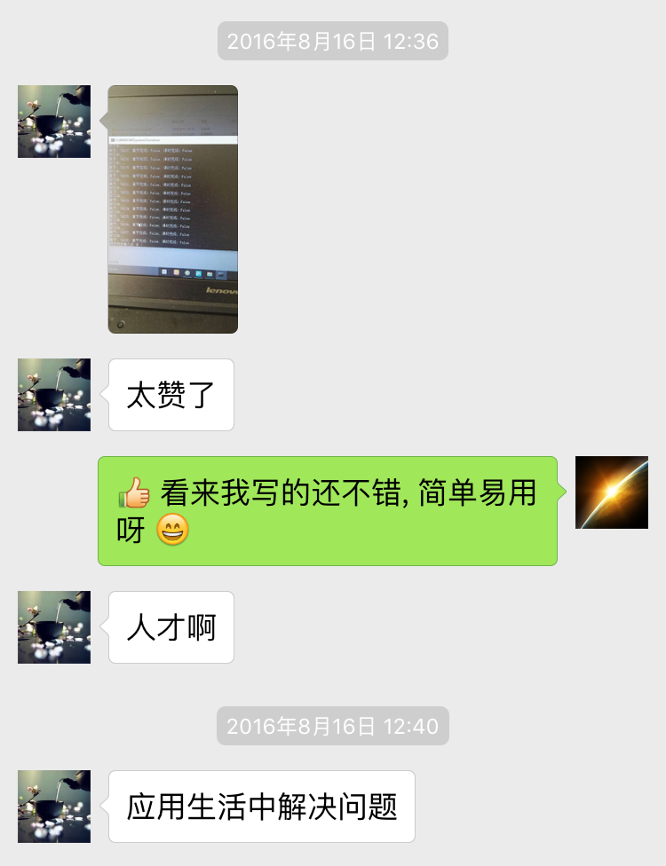

## 驾校视频自动看（“学车不”平台）

[](https://www.python.org)


### 使用方法：

1. 安装`Python`（3.5 或更高版本）

3. 下载代码

4. 安装依赖（`Requests`）：`pip install -r requirements.txt`

6. 运行：`python xuechebu_crack.py`

> 也可以下载[打包好的版本](https://pan.baidu.com/s/1i5GJQoH)直接运行.

<br>


### 说明:

以下内容节选自2016年写给老师的“学长来信”：

> 凡人皆有一死，凡人皆需奉侍，凡是系统皆有漏洞（哈哈哈，强行关联）。
>
> 前一段时间正在学车，现在驾考的理论部分已经不需要去驾校了，可以直接在线学习，但有一点限制，那就是你得看完整个视频… 上有政策，下有对策，大部分人都是打开视频后扔到后台然后干别的去了，然后时不时的去查看一下放完了没有，需不需要切换到下一课时。但是播放视频需要先进行下载，解码视频需要 CPU，而视频播放了你又不看，简直浪费带宽，浪费 CPU，浪费服务器，浪费电啊，浪费社会资源，真是太不环保了~
>
> 作为一名骄傲的程序员我能这么做吗？抱着试试看的态度，我打开了我心爱的 Firefox 浏览器，打开开发者工具，切换到“网络”一栏，这样一来浏览器和网站间的通信就一览无余了~
>
> 
>
> 随着学习的继续，一行一行的网络请求记录映入眼帘:
>
> ```log
> http://xcbapi.xuechebu.com/videoApi/video/GetChapterList?os=pc
>
> http://xcbapi.xuechebu.com/videoApi/video/GetShouldChapter?os=pc
>
> http://xcbapi.xuechebu.com/videoApi/student/UpdatePlay
> ```
> 运气不错~ 这几个请求看名字就基本能知道是干什么的了~ 原来服务器端的检测不是很严格，只要给它传个大于视频时长的数据它就认为我们学完了对应的课程。 略微完善下代码，一个能快速学习驾考理论课程并节约社会资源的程序就出炉了~

<br>


### 输出示例:

```log
来来来~ 上课啦~

(ง •̀_•́)ง

请输入驾校帐号: 370XXXXXXXXXXXXXXX
请输入密码:
登录成功! 姓名: XX, 驾校: 海淀驾校.

# 第一课时:
## 第一章节 已学
## 第二章节 已学
## 第三章节 已学
...
# 第八课时:
## 第一章节 已学
## 第二章节 已学
## 第三章节 已学
...
# 第十六课时:
## 第一章节 已学
## 第二章节 已学

获取应学章节出错: 请求出错: 您已经预约科目四考试不能观看

恭喜~ 已完成今天的学习~

[]~(￣▽￣)~*
```

<br>


### 好评如潮 😄:






